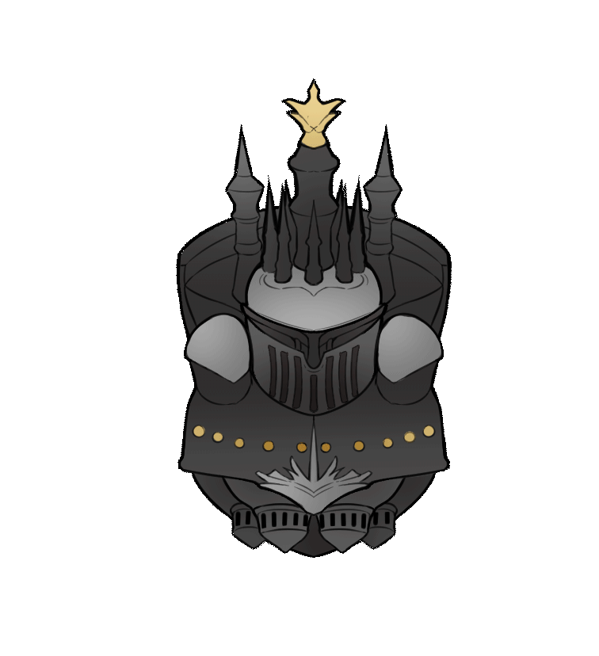

# CODEX

Extra gauges and buff trackers for FFXIV



## Installation
1. ACT + FFXIV Plugin
2. [NGLD's OverlayPlugin](https://github.com/quisquous/cactbot#install-ngld-overlayplugin)
3. For gauges, add a new Miniparse overlay, and point the url to `https://mkaminsky11.github.io/Codex/index.html`
4. For buff tracker, add a new Miniparse overlay, and point the url to `https://mkaminsky11.github.io/Codex/buffs.html`
5. After positioning the overlays, check "Lock  Overlay" and "Enable Clickthrough" in ACT

### (For Streamers)
1. In OBS, add new brower sources pointing to `https://mkaminsky11.github.io/Codex/index.html?OVERLAY_WS=ws://127.0.0.1:10501/ws` or `https://mkaminsky11.github.io/Codex/buffs.html?OVERLAY_WS=ws://127.0.0.1:10501/ws`

## Job Gauges
Shows information such as how much time you have left on your DoT (Biolysis, Dia, etc.), how many gcds you have gotten under buffs (Inner release, Perfect Balance)

## Buff Tracker
Shows which party buffs are currently active and how long until they are off cooldown. For Astrologian, also shows which personal buffs your party members are using so that you can give them cards.


## Known Issues
+ The overlay has problems in exploration zones (Eureka and Bozja), and will often not register actions correctly. I'm looking into it :/

## FAQs
### Do I need Cactbot for this to work?
> No
### How to I change the overlay settings?
> Hover your cursor over the gauges and click on the cog icon. Make sure "Enable Clickthrough" is not checked in ACT.
### Why aren't my party buffs showing up?
> Make sure to add a new overlay pointing to `https://mkaminsky11.github.io/Codex/buffs.html`. Otherwise, open an [Issue](https://github.com/mkaminsky11/Codex/issues/new)
### Why does it say "UNLOCKED (LOCK BEFORE USING)"
> Check "Lock Overlay" inside of ACT ([see this image](https://github.com/quisquous/cactbot/raw/main/screenshots/overlay_plugin_new_raidboss_locked.png))

## TODO Log
```
- [WIP] change buff size
- glows on arrows
- multi-DoT tracker
- multi-buffs (if you have multiple of a job in your party)
- [WIP] change bar type
- change arrow size
- material UI or base FFXIV
- add buff settings (change size, etc.)
- stop flashing dot warning after a while (if enabled)
- reset button
```

## Jobs

###  DRK
+ **Gauges**: GCDS used in Delirium, GCDS used in Blood Weapon
+ **Buffs**: Delerium, Living Shadow

###  WAR
+ **Gauges**: GCDS used in Inner Release, Storm's Eye tracker
+ **Buffs**: Inner Release

###  PLD
+ **Gauges**: GCDS used in Requiescat, GCDS used in Fight or Flight, Goring Blade tracker

###  GNB
+ **Gauges**: GCDS used in No Mercy

###  SCH
+ **Gauges**: Biolysis tracker
+ **Buffs**: Chain Stratagem

###  WHM
+ **Gauges**: Dia tracker

###  AST
+ **Gauges**: Combust Tracker
+ **Buffs**: Cards, Divination

###  MNK
+ **Gauges**: GCDS used in Riddle of Fire, GCDS used in Perfect Balance
+ **Buffs**: Brotherhood, Riddle of Fire

###  DRG
+ **Gauges**: GCDS used in Lance Charge, GCDS used in Dragon Sight
+ **Buffs**: Dragon Sight, Litany, Lance Charge

###  NIN
+ **Gauges**: GCDS used in Trick
+ **Buffs**: Trick Attack, Bunshin

###  SAM
+ **Gauges**: Jinpu tracker, Shifu tracker, Higanbana tracker
+ **Buffs**: Double Midare

###  BRD
+ **Gauges**: GCDS used in Raging Strikes, Caustic Bite tracker, Stormbite tracker
+ **Buffs**: Battle Voice, Raging Strikes

###  MCH
+ **Gauges**: GCDS used in Hypercharge, GCDS used in Wildfire
+ **Buffs**: Wildfire

###  DNC
+ **Gauges**: GCDS used in Devilment
+ **Buffs**: Technical Step, Devilment

###  BLM
+ **Gauges**: Thunder tracker

###  SMN
+ **Gauges**: Bio tracker, Miasma tracker, Wyrmwave and Scarlet Flame tracker
+ **Buffs**: Devotion, Summon Bahamut, Firebird Trance

###  RDM
+ **Gauges**: GCDS used in Manification
+ **Buffs**: Embolden, Manafication

###  BLU
+ **Gauges**: Song of Torment tracker
+ **Buffs**: Off-guard, Peculiar Light
+ **TODO:** Revenge blast indicator

## Issues and Acknowledgement
Thank you to [skotlex](https://github.com/skotlex/ffxiv-material-ui) for the awesome icons.

Thank you to [goaaats](https://github.com/goaaats/ffxiv-explorer-fork) and all the contributors of FFXIV-Explorer for the `.atex` conversion code

Please report any issues [here](https://github.com/mkaminsky11/Codex/issues) or message me @ ocealot#4484