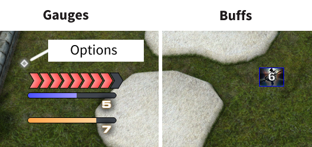

# CODEX

Extra gauges and buff tracker for FFXIV

## Installation
1. ACT + FFXIV Plugin
2. [NGLD's OverlayPlugin](https://github.com/quisquous/cactbot#install-ngld-overlayplugin)
3. For gauges, add a new Miniparse overlay, and point the url to `https://mkaminsky11.github.io/Codex/index.html`
4. For buff tracker, add a new Miniparse overlay, and point the url to `https://mkaminsky11.github.io/Codex/buffs.html`

### Job Gauges
Shows information such as how much time you have left on your DoT (Biolysis, Dia, etc.), how many gcds you have gotten under buffs (Inner release, Perfect Balance)

### Buff Tracker
Shows which party buffs are currently active and how long until they are off cooldown. For Astrologian, also shows which personal buffs your party members are using so that you can give them cards.

+ **TODO**: multi-DoT tracker
+ **TODO**: multi-buffs (if you have multiple of a job in your party)
+ **TODO**: change bar type
+ **TODO**: change arrow size
+ **TODO**: change refresh time (how often dots update)
+ **TODO**: change timeout time (how long after gcd timer it disappears)
+ **TODO**: material UI or base FFXIV
+ **TODO**: force AST mode for buffs (show everybody's personal buffs)
+ **TODO**: add buff settings (toggle individual buffs, change size, etc.)
+ **TODO**: stop flashing dot warning after a while (if enabled)
+ **TODO**: reset button

## Jobs

### DRK
+ GCDS used in Delirium
+ GCDS used in blood Weapon

### WAR
+ GCDS used in Inner Release
+ Storm's Eye tracker

### PLD
+ GCDS used in Requiescat
+ GCDS used in Fight or Flight
+ Goring Blade tracker

### GNB
+ GCDS used in No Mercy

### SCH
+  Biolysis tracker

### WHM
+ Dia tracker

### AST
+ Combust Tracker

### MNK
+ GCDS used in Riddle of Fire
+ GCDS used in Perfect Balance

### DRG
+ GCDS used in Lance Charge
+ GCDS used in Eye

### NIN
+ GCDS used in Trick

### SAM
+ Jinpu tracker
+ Shifu tracker
+ Higanbana tracker

### BRD
+ GCDS used in Raging Strikes
+ Caustic Bite tracker
+ Stormbite tracker

### MCH
+ GCDS used in Overheat
+ GCDS used in Wildfire

### DNC
+ GCDS used in Devilment

### BLM
+ Thunder tracker

### SMN
+ Bio tracker
+ Miasma tracker
+ Wyrmwave and Scarlet Flame tracker

### RDM
+ GCDS used in Manification

### BLU
+ Song of Torment tracker
+ **TODO:** Revenge blast indicator

## Options
+ round or square corners
+ silver border or none
+ change color
+ change order
+ hide specific gauges
+ adjust size